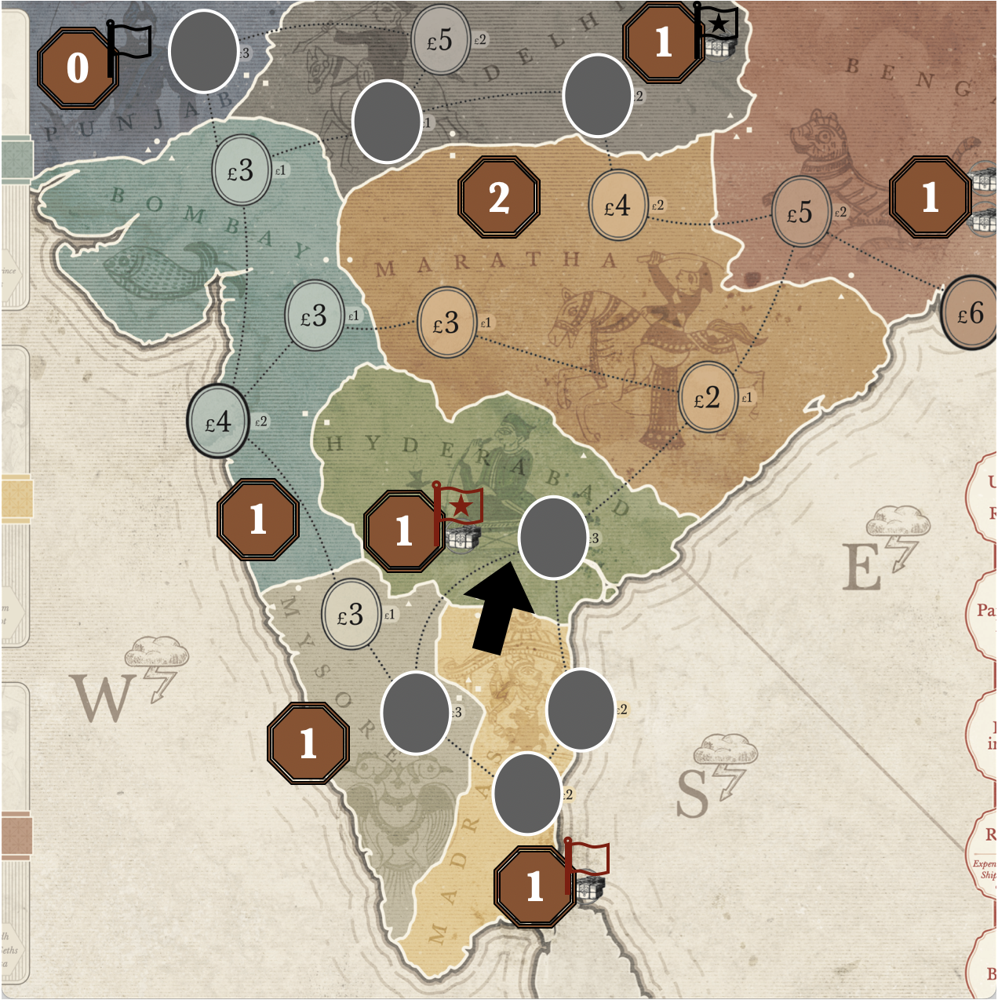

import { Steps } from '@astrojs/starlight/components';

For this scenario, the focus on the 1730s-1790s, delving into England's relationship with its American Colonies and the impact of the East India Company on that relationship. As with the original scenarios, the perspective is from families of the British Empire, utilizing the East India Company and the Colonies to improve their financial and social status. The current working title is __1733: Tea & Business__.

## Why 1733?

The year __1733__ was chosen because:
1. __1733__ is the year the [Molasses Act](https://en.wikipedia.org/wiki/Molasses_Act) was enacted. The Molasses Act is considered the last of the [Acts of Trade and Navigation](https://en.wikipedia.org/wiki/Navigation_Acts) before Britain tried various other regulations and tariffs in the 1750-60s.
2. __1733__ is exactly 100 years before the EIC's monopoly in China came to an end, in 1833.

The following historical events also happened in the previous couple of years:
* According to several historians, piracy in the Caribbean and North America had been significantly reduced, allowing more consistent and successful trade.
* __1729__: The first Chinese prohibition against opium was announced.
* __1729__: North and South Carolina were officially chartered as royal colonies, buying out the proprietary rulers.
* __1729__: The Treaty of Seville was signed, ending the most recent war betwen the Britain and Spain. Tensions between the two countries were unresolved.
* __1730__: EIC's charter is renewed and England gets involved in Green Tea.
* __1732__: The founding of the Province of Georgia, the last of the 13 colonies. Settlement began the next year in 1733.

### Naming

Due to the importance of Tea in this scenario, the current working title is __Tea & Business__ as:
1. It's a play on the phrase "tea &amp; biscuits".
2. It's an attempt to emphasize that this is looking at the relationship to the American Colonies from a business or financial perspective.

:::tip[Alternative Names]
- __Empire &amp; Tea__
    - Referencing the larger scale of this scenario, it's a play on the word "entirety", talking about the British Trading Empire as a whole.
- __Tea &amp; Company__
    - A play on the phrase "tea and sympathy".
    - It provides a double entendre as the EIC has "company" (the additional presence of the Government and America in this scenario).
- Similar, but more straightforward, names include:
    - __Tea &amp; Colonies__
    - __Tea &amp; Liberty__
:::

## The 13 Colonies

This scenario is designed to be a different lens on the story that John Company: Second Edition is trying to tell. It zooms out, focusing more on the government and how the EIC interoperated with British trade in the 13 colonies. It focuses on Tea because of the British and America obsession with Tea during the 18th century, which raises the importance of the Chinese trade.

It's also meant to show the contrast of the EIC's relationship with India to Britain's relationship to Colonial America. There's also the similarity of the British families trying to 'move up' into the social elite, at the same time that Britain is trying to 'move up' to become a global superpower - using India, China and America to do so.

A few other points of note:

- A contrast of how the EIC managed trade and relations in India versus how the British Government managed trade and relations with its colonies in America.
   - One of the larger elements is the difference in how tariffs/trade was managed and applied.
- The East India Company, due to the amount of debt and the amount of unsold tea in warehouses, gained the right to sell tea at a much lower rate in America, thus gaining a monopoly, from a British perspective.
- How interrelated (and similar) the massive debt the East India Company and the British Government were facing.

:::caution
This is not a scenario about the American Revolutionary War itself. While the events leading up to the war are focused on (the various tariffs, "taxation without representation", etc), the historic military action in America is not a focus. This lack of focus is similar to how the various battles in India during this time are referenced and can be reproduced in the game, but they are not directly simulated. Those wanting to play a scenario simulating the American Revolutionary War will likely be disappointed.
:::

## India

While there is a focus on the 13 colonies, this scenario is still primarily about the East India Company and the British Empire. Cole said this himself: "[John Company is about India... not the Boston Tea Party](https://youtu.be/iNMTcUIN1gk?t=1016)". Granted, this scenario is trying to reference the Boston Tea Party, but India is still a primary focus and all of the laws and events from the original scenarios are available, aside from deregulation.

The existing geography and orders of India has already been set by the established board. So, for this scenario, the only thing to really decide about India is the starting empires, military strength and position of the elephant. 

From a gameplay perspective, the starting state of India will be similar to both the __1710__ and __1758__ scenarios. The initial focus is placed on events that occurred during the 1730s and 1740s (namely the Carnatic Wars). Every other scenario has 7 of the 17 orders closed at the start, so a decision was made to match that number.

We're basing the start of this scenario on the following historical events:

<Steps>

1. The Maratha Confederacy attacked the Mughal Empire north in Delhi (1737). They also attacked the Mughal Empire (and the Hyderabad State) in the south for control of the Arcot (1741-1743). The Arcot region is essentially the ___Madras___ region on the John Company map of India.

    :::note
    The __1710__ scenario already depicted ___Maratha___ attacking ___Delhi___ to the north. The existing map/rules does not allow ___Maratha___ to attack the region of ___Madras___ directly. Because of these factors, ___Maratha___ is left to be a strong central region that can be aggressive towards its surrounding regions.
    :::

2. The [Carnatic Wars](https://en.wikipedia.org/wiki/Carnatic_wars) were fought on the southeastern side of India during the mid-to-late 1740s (which roughly corresponds between Turn 2-3 during the game). On the John Company map of India, this is depicted by the regions of ___Hyderabad___ and ___Madras___.

    To represent this, both ___Hyderabad___ and ___Madras___ are depicted as the Hyderabad state, with the Nawab of the Carnatic (___Madras___) rebelling against the Nizam of __Hyderabad__ for control. To represent this, the Elephant is positioned similarly and all of the southeastern trade* orders are closed (due to the upcoming battles). Historically, this power struggle led to the British fighting the French in this geographic area. 

    :::caution[Southeastern Trade*]
    It can be argued that the £2 order in __Maratha__ should be closed instead of the £6 order in __Mysore__. The current setup matches the __1758__ scenario, and the adjustment would provide a bit more variety.

    The downside of making this choice is that the trade orders for the Bombay Presidency are wide open and unchallenged, while the Bengal Presidency is restricted and the Madras Presidency is fully closed. Narratively, we want to motivate the Company to be involved in both the sourthern and eastern sides of India, where the export icons are.
    :::

3. The Mughal Empire is continuing to lose power, due to the Marathas raiding Delhi in 1737 and [Nader Shah Afshar](https://en.wikipedia.org/wiki/Nader_Shah#Invasion_of_India) advancing into Northern India in the late 1730s, reaching Delhi in 1739.

    To represent this, ___Punjab___ and ___Delhi___ are still together as an empire (providing a second empire for this scenario). However, ___Delhi___, like every other scenario, has both of its incoming trade routes closed, to show the conflict in the region.

    :::note
    This mirrors the exact setup of the __1710__ scenario. To be different, we could switch the strength values of ___Punjab___ and ___Delhi___, but this allows Punjab to rebel very easily.
    :::

    :::caution[Alternative]
    In all other scenarios, ___Delhi___ has both of it's connecting trade routes blocked. To be a little different and to represent the loss of wealth, we could open the cheapest and most southern (£3) trade order instead. However, this would open up Bombay even more, so it was decided against. 
    :::

4. ___Mysore___ was weaker due to inner conflict before Hyder Ali took over in the 1760s. As a result, the choice was made to keep their region strength at 1, similar to the __1710__ scenario.

</Steps>