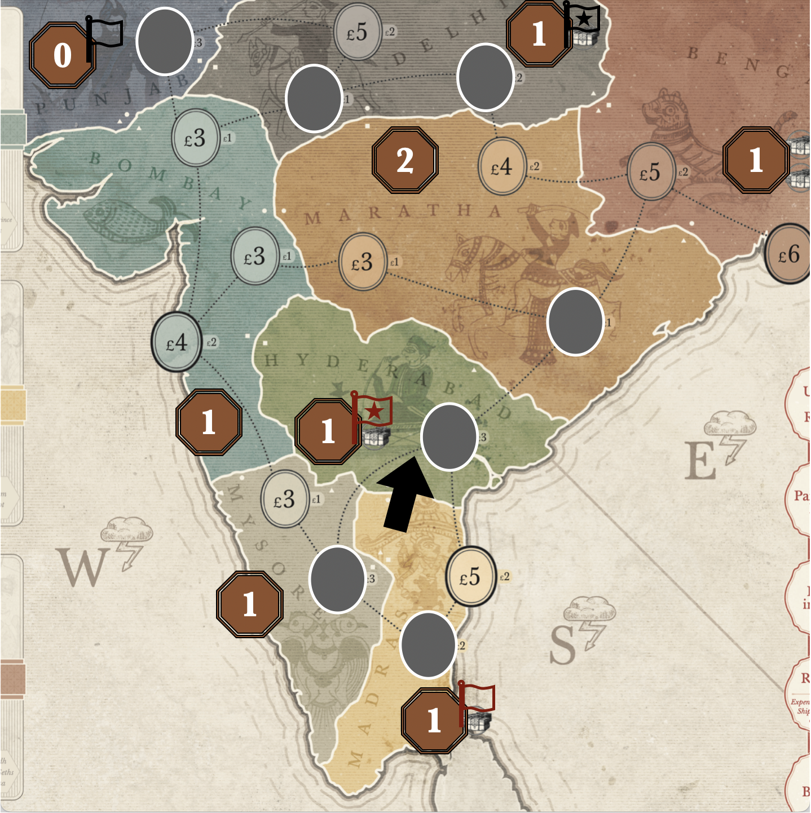

## Scenario Components

- Scenario Board.
- Setup Cards for 1733.
- {frontmatter._["tea.tokens.plural"]} (use poker chips).
- Debt Markers (use red cubes).
- Office Cards for 1733.
- {frontmatter._[""]}
- Statute Deck.
- Office overlay for {frontmatter._["role.company.tea2"]}

## Additions to Setup

When setting up this scenario, follow the usual rules for setup.

When you get to step 9, do the following:
1. Place the scenario board next to the main board.
2. Place the Tariff cards near the Law cards.
3. Place the Tea Crates where they are accessible.
4. Use the Setup and Scenario Cards.
5. Place the "Tea Regulation" and "Navigation Acts" as you other passed laws.

### The Board

:::note[Initial board]

Use the following map and instructions to setup India:

__TODO__: Try opening the Madras Port and closing the Maratha SE space.

* Closed Orders
  * All orders in ___Punjab___, ___Hyderabad___ and ___Madras___ are closed.
  * The two southernmost orders in ___Delhi___ are closed (£3 and £5).
  * The £6 order in ___Mysore___ is closed.
* Region Strength
  * ___Maratha___ has a strength of 2.
  * ___Punjab___ has a strength of 0.
  * All other regions have a strength of 1.
* Empires
  * One empire is located in the north, with ___Delhi___ dominating ___Punjab___.
  * There is one empire in the south, with ___Madras___ serving ___Hyderabad___.
* The elephant is pointing from ___Madras___ into ___Hyderabad___.

:::